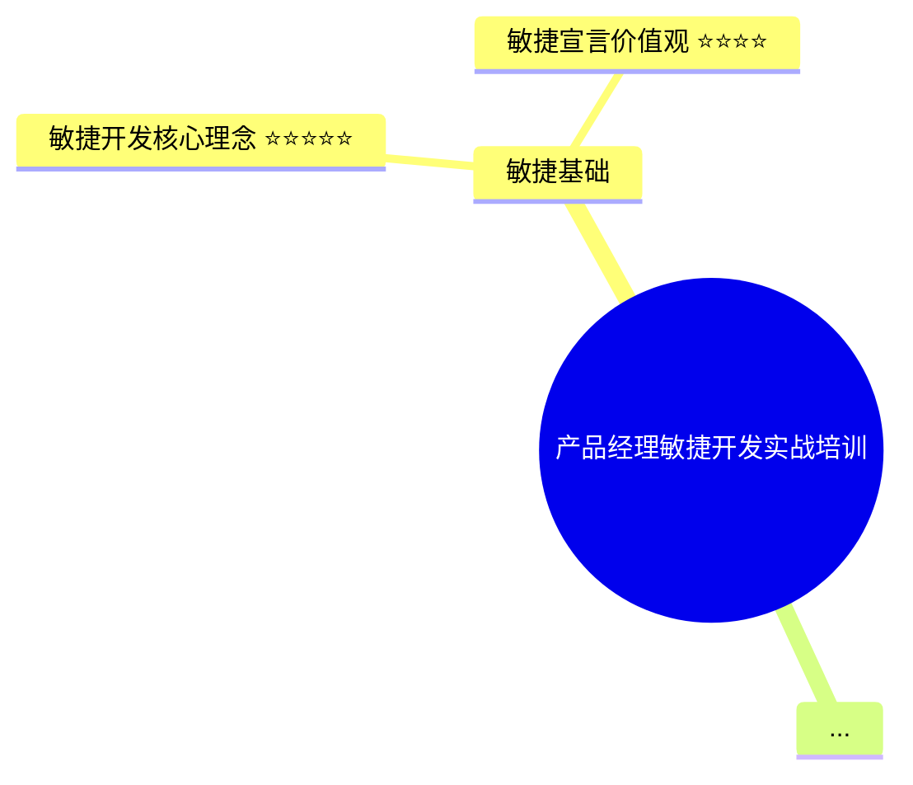

# 🧪 快速测试指南

## 工具已就绪！✅

项目所有组件都已创建完成：
- ✅ 核心代码模块（知识提取、卡片生成、总图生成）
- ✅ 命令行界面
- ✅ 示例培训逐字稿（敏捷开发培训，约 3000 字）
- ✅ 完整文档

## 开始测试（3 步）

### 步骤 1: 获取 Anthropic API Key

1. 访问 Anthropic 控制台: https://console.anthropic.com/
2. 注册/登录账号
3. 进入 Settings → API Keys: https://console.anthropic.com/settings/keys
4. 点击 "Create Key" 创建新的 API Key
5. 复制生成的 Key（格式: `sk-ant-api03-xxxxx...`）

**注意**:
- 新用户通常有免费额度可以测试
- API key 只显示一次，请妥善保存

### 步骤 2: 配置 API Key

选择以下任一方式配置：

**方式 1: 使用 .env 文件（推荐）**
```bash
# 创建 .env 文件
cp .env.example .env

# 编辑 .env 文件，填入你的 API Key
echo "ANTHROPIC_API_KEY=sk-ant-api03-your-key-here" > .env
```

**方式 2: 命令行参数**
```bash
python main.py --input examples/sample_training.txt --api-key sk-ant-api03-your-key-here
```

**方式 3: 环境变量**
```bash
export ANTHROPIC_API_KEY=sk-ant-api03-your-key-here
python main.py --input examples/sample_training.txt
```

### 步骤 3: 运行测试

**快速测试（生成 5 张卡片）**
```bash
python main.py --input examples/sample_training.txt --max-cards 5
```

**完整测试（生成 8 张卡片）**
```bash
python main.py --input examples/sample_training.txt
```

**自定义输出目录**
```bash
python main.py --input examples/sample_training.txt --output my_test_output
```

## 预期输出

运行成功后，你会看到：

```
🎴 培训知识卡片生成器
将培训逐字稿转化为结构化的知识卡片

配置信息:
  输入文件: /path/to/examples/sample_training.txt
  输出目录: ./output
  最大卡片数: 5
  AI 模型: claude-3-5-sonnet-20241022

正在加载培训逐字稿: examples/sample_training.txt
✓ 已加载 5347 字符

⠋ 正在分析培训内容，提取核心知识点...
✓ 已提取 X 个核心知识点
培训主题: 产品经理敏捷开发实战培训

正在生成 5 张知识卡片...
⠋ 生成卡片 1/5: 敏捷开发核心理念
⠋ 生成卡片 2/5: 用户故事 INVEST 原则
⠋ 生成卡片 3/5: Sprint 计划流程
⠋ 生成卡片 4/5: 每日站会实践
⠋ 生成卡片 5/5: 看板可视化管理
✓ 已生成 5 张知识卡片

正在生成总览文档...
✓ 已保存总览: output/overview.md
正在保存知识卡片...
✓ 已保存 5 张卡片到: output/cards

🎉 知识卡片生成完成！

输出目录: /path/to/output
- 总览: overview.md
- 卡片: cards/card_01.md ~ cards/card_05.md
```

## 查看生成的内容

### 1. 查看总览
```bash
cat output/overview.md
```

总览包含：
- 📋 培训摘要
- 🗺️ Mermaid 思维导图
- 📚 主要分类
- 💡 核心知识点列表
- 🎴 知识卡片索引

### 2. 查看知识卡片
```bash
# 查看第一张卡片
cat output/cards/card_01.md

# 查看所有卡片
ls -lh output/cards/
```

每张卡片包含：
- 🎯 核心要点（3-5个）
- 📝 详细说明（150-300字）
- 💡 实际示例（2-3个）
- ⚠️ 提示与注意事项
- 🔗 相关主题

### 3. 在 Markdown 编辑器中查看

**推荐工具**:
- **Typora**: 支持 Mermaid 思维导图渲染
- **VS Code**: 安装 Markdown Preview Enhanced 插件
- **GitHub**: 直接上传到 GitHub 仓库查看

## 示例输出预览

### 总览文档结构
```markdown
# 产品经理敏捷开发实战培训

## 📋 培训摘要
本培训深入探讨敏捷开发方法论...

## 🗺️ 知识总览


## 📚 主要分类
1. **敏捷基础**
2. **实践方法**
...
```

### 知识卡片结构
```markdown
# 📇 卡片 01: 用户故事 INVEST 原则

> 编写高质量用户故事的黄金法则

## 🎯 核心要点
1. Independent - 用户故事应该相互独立
2. Negotiable - 细节可以协商调整
3. Valuable - 必须对用户有价值
...

## 📝 详细说明
INVEST 原则是编写用户故事的重要指南...

## 💡 实际示例
### 示例 1
错误写法："系统需要一个登录功能"
正确写法："作为注册用户，我希望..."
...
```

## 测试不同场景

### 1. 测试较少卡片（快速）
```bash
python main.py --input examples/sample_training.txt --max-cards 3
```
适合快速验证工具是否工作

### 2. 测试更多卡片（完整）
```bash
python main.py --input examples/sample_training.txt --max-cards 10
```
适合完整体验所有功能

### 3. 使用自己的培训内容
```bash
# 1. 将你的培训逐字稿保存为 .txt 文件
# 2. 运行工具
python main.py --input your_training.txt --output your_output
```

## 测试性能

一次完整运行大约需要：
- **知识提取**: 10-20 秒
- **生成 5 张卡片**: 30-60 秒
- **生成 8 张卡片**: 50-90 秒
- **总计**: 1-2 分钟

**影响因素**:
- 培训内容长度
- 卡片数量
- API 响应速度
- 网络状况

## 成本估算

使用 Claude 3.5 Sonnet 模型：
- **输入**: ~$3 / 百万 tokens
- **输出**: ~$15 / 百万 tokens

**示例估算**（处理 3000 字培训）:
- 输入 tokens: ~10,000
- 输出 tokens: ~15,000
- 预估成本: **~$0.25-0.50**

生成 5-8 张卡片的成本通常在 **$0.20-0.60** 之间。

## 故障排查

### 问题 1: API Key 错误
```
❌ 错误: 未设置 ANTHROPIC_API_KEY
```
**解决**: 检查 API Key 是否正确配置

### 问题 2: 网络连接失败
```
Error: connection timeout
```
**解决**: 检查网络连接，可能需要代理

### 问题 3: Token 超限
```
Error: maximum token limit exceeded
```
**解决**: 减少输入文本长度或卡片数量

### 问题 4: Mermaid 图表不显示
**解决**: 使用支持 Mermaid 的 Markdown 查看器

## 下一步

测试成功后，你可以：

1. **处理真实培训内容**
   - 整理你的培训逐字稿
   - 运行工具生成知识卡片
   - 分享给团队成员

2. **定制和优化**
   - 调整生成的卡片数量
   - 修改卡片内容格式
   - 添加自定义功能

3. **批量处理**
   - 处理多个培训文件
   - 建立知识库
   - 自动化工作流

4. **反馈和改进**
   - 报告问题
   - 提出新功能建议
   - 贡献代码

## 需要帮助？

- 📖 查看 [使用指南](./USAGE_GUIDE.md)
- 🏗️ 查看 [架构文档](./ARCHITECTURE.md)
- 💬 提交 Issue 到项目仓库

---

**祝测试顺利！如有问题随时反馈。** 🚀
