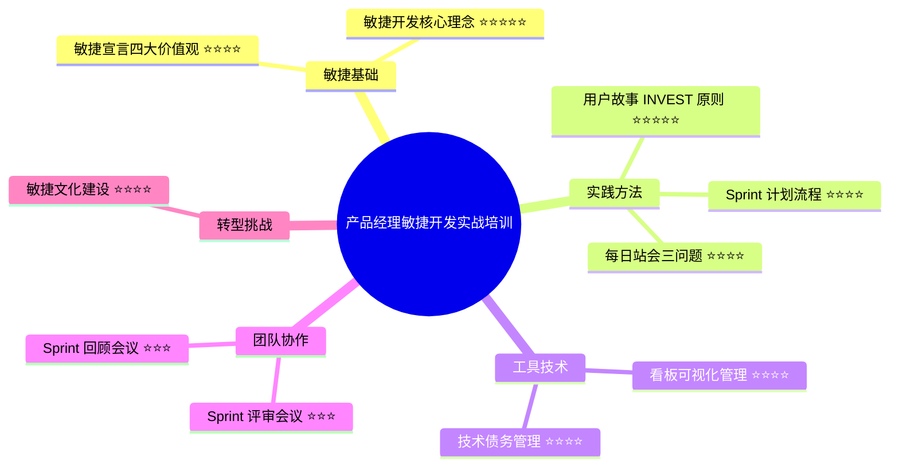

# 示例输出展示

本文档展示运行 `python main.py --input examples/sample_training.txt --max-cards 5` 后生成的内容示例。

## 1. 总览文档 (overview.md) 示例

```markdown
# 产品经理敏捷开发实战培训

## 📋 培训摘要

本培训深入探讨产品经理如何在实际工作中应用敏捷开发方法论。培训涵盖敏捷开发的核心理念、用户故事编写、Sprint 计划与执行、每日站会实践、看板管理、Sprint 评审与回顾、技术债务管理以及敏捷转型挑战。通过理论讲解和实际案例分析，帮助产品经理掌握敏捷开发的精髓，提升团队协作效率和产品交付质量。

## 🗺️ 知识总览



## 📚 主要分类

1. **敏捷基础**
2. **实践方法**
3. **工具技术**
4. **团队协作**
5. **转型挑战**

## 💡 核心知识点

### 敏捷基础

1. **敏捷开发核心理念** ⭐⭐⭐⭐⭐
   - 快速迭代、持续反馈、拥抱变化的思维方式，应对需求不确定性的有效方法

2. **敏捷宣言四大价值观** ⭐⭐⭐⭐
   - 个体和互动、工作软件、客户合作、响应变化的优先级原则

### 实践方法

3. **用户故事 INVEST 原则** ⭐⭐⭐⭐⭐
   - 编写高质量用户故事的六大黄金法则：独立、可协商、有价值、可估算、小型、可测试

4. **Sprint 计划流程** ⭐⭐⭐⭐
   - 1-4 周时间盒、双阶段计划会议、Product Backlog 优先级排序、故事点估算

5. **每日站会三问题** ⭐⭐⭐⭐
   - 15 分钟内团队同步：昨天做了什么、今天计划做什么、遇到什么障碍

### 工具技术

6. **看板可视化管理** ⭐⭐⭐⭐
   - 可视化工作流、识别瓶颈的重要工具，包含待办、进行中、待验证、已完成状态

7. **技术债务管理** ⭐⭐⭐⭐
   - 平衡新功能开发和技术完善，建议每个 Sprint 分配 20% 时间处理技术债务

## 🎴 知识卡片索引

共生成 5 张知识卡片：

1. [敏捷开发核心理念](./cards/card_01.md)
   > 快速迭代、持续反馈、拥抱变化的产品开发思维方式

2. [用户故事 INVEST 原则](./cards/card_02.md)
   > 编写高质量用户故事的六大黄金法则

3. [Sprint 计划与执行](./cards/card_03.md)
   > 敏捷开发时间盒的规划和实施方法

4. [每日站会最佳实践](./cards/card_04.md)
   > 15 分钟高效团队同步的三个关键问题

5. [看板可视化管理](./cards/card_05.md)
   > 直观展示工作流程、快速识别瓶颈的工具

## 📖 使用说明

1. 先阅读本总览，了解培训内容的整体结构
2. 根据思维导图和知识点列表，确定学习重点
3. 点击卡片索引中的链接，深入学习每个知识点
4. 每张卡片都包含核心要点、详细说明、示例和实用建议
5. 建议按照重要性（星级）优先学习高价值内容

---
*本知识卡片由 AI 自动生成，基于培训逐字稿提取核心内容*
```

## 2. 知识卡片 (card_01.md) 示例

```markdown
# 📇 卡片 01: 敏捷开发核心理念

> 快速迭代、持续反馈、拥抱变化的产品开发思维方式

## 🎯 核心要点

1. 敏捷不仅是流程，更是一种应对不确定性的思维方式
2. 核心理念：快速迭代、持续反馈、拥抱变化
3. 与瀑布式开发不同，敏捷接受需求是不断变化的现实
4. 敏捷宣言强调个体互动、工作软件、客户合作、响应变化的优先级

## 📝 详细说明

敏捷开发是为了应对软件开发中的不确定性而诞生的方法论。传统的瀑布式开发要求在项目开始前定义所有需求，但现实工作中需求总是在不断变化。敏捷开发正视这一现实，通过快速迭代、持续反馈和拥抱变化来提高产品交付的成功率。

敏捷宣言提出了四个核心价值观：个体和互动高于流程和工具、工作的软件高于详尽的文档、客户合作高于合同谈判、响应变化高于遵循计划。这并不是说后者不重要，而是在两者之间，前者应该获得更多关注和重视。

理解敏捷的本质，不是简单地采用某些实践，而是要建立起快速响应、持续改进的思维方式。这要求团队成员有更强的主动性、更好的沟通协作能力，以及对不确定性的包容心态。

## 💡 实际示例

### 示例 1

**传统瀑布式**：某公司花费 3 个月完整规划一个功能，开发 6 个月后发现市场需求已经改变，产品无法满足实际需要。

**敏捷方式**：将功能分解为多个小版本，每 2 周发布一个可用版本，根据用户反馈不断调整方向，最终产品更贴近市场需求。

### 示例 2

**需求变化场景**：客户在项目中期提出新需求。传统模式下这被视为"范围蔓延"，需要重新签约。敏捷模式下，团队在下一个 Sprint 评估新需求的优先级，灵活调整待办列表，快速响应客户需要。

## ⚠️ 提示与注意事项

1. 敏捷不等于没有计划，而是适应性计划，需要持续调整
2. 实施敏捷需要管理层支持和文化转变，不能仅靠流程改变
3. 不要机械照搬敏捷实践，要根据团队实际情况灵活调整
4. 敏捷转型是一个持续的过程，需要耐心和持续改进的决心

## 🔗 相关主题

- 敏捷宣言四大价值观
- Sprint 迭代开发
- 持续集成与持续交付
- 精益创业方法论

---
[← 返回总览](../overview.md)
```

## 3. 知识卡片 (card_02.md) 示例

```markdown
# 📇 卡片 02: 用户故事 INVEST 原则

> 编写高质量用户故事的六大黄金法则

## 🎯 核心要点

1. Independent (独立的) - 用户故事应该尽可能独立，减少依赖
2. Negotiable (可协商的) - 细节可以在开发过程中协商调整
3. Valuable (有价值的) - 必须对用户或业务有明确价值
4. Estimable (可估算的) - 团队能够估算完成所需工作量
5. Small (小的) - 足够小，能在一个 Sprint 内完成
6. Testable (可测试的) - 有明确的验收标准，可以测试验证

## 📝 详细说明

INVEST 原则是敏捷开发中编写用户故事的重要指南。一个好的用户故事应该遵循"作为[角色]，我希望[功能]，以便[价值]"的格式，明确说明谁需要什么功能以及为什么需要。

Independent（独立）意味着用户故事之间的依赖关系要最小化，这样可以灵活调整开发顺序。Negotiable（可协商）强调用户故事不是固定的合同，细节可以在开发过程中与团队讨论和调整。

Valuable（有价值）确保每个用户故事都能为用户或业务带来实际价值，避免技术导向的故事。Estimable（可估算）要求故事描述足够清晰，团队能够估算工作量。Small（小）确保故事不会过大，能在一个 Sprint 内完成。Testable（可测试）要求有明确的验收标准，知道何时算"完成"。

## 💡 实际示例

### 示例 1

**❌ 糟糕的用户故事**：
"系统需要一个登录功能"

**问题**：没有说明是谁、为什么、如何验证

**✅ 良好的用户故事**：
"作为一个注册用户，我希望能够使用邮箱和密码登录，这样我就可以访问我的个人数据"

**优点**：明确了角色（注册用户）、功能（邮箱密码登录）、价值（访问个人数据）

### 示例 2

**验收标准示例**：

用户故事：作为用户，我希望能够重置密码

验收标准：
- 用户点击"忘记密码"链接
- 系统发送重置链接到用户邮箱
- 链接在 24 小时内有效
- 用户通过链接设置新密码
- 新密码符合安全要求（至少 8 位，包含字母和数字）

## ⚠️ 提示与注意事项

1. 用户故事应该从用户视角编写，而不是技术实现角度
2. 验收标准要在 Sprint 计划时就明确，不要事后定义
3. 如果一个故事太大，考虑拆分成多个小故事
4. 定期审查用户故事，确保仍然符合 INVEST 原则

## 🔗 相关主题

- 验收标准编写
- 故事点估算
- Product Backlog 管理
- 需求工程

---
[← 返回总览](../overview.md)
```

## 4. 目录结构

生成后的完整目录结构：

```
output/
├── overview.md              # 总览文档（含思维导图）
└── cards/                   # 知识卡片目录
    ├── card_01.md          # 敏捷开发核心理念
    ├── card_02.md          # 用户故事 INVEST 原则
    ├── card_03.md          # Sprint 计划与执行
    ├── card_04.md          # 每日站会最佳实践
    └── card_05.md          # 看板可视化管理
```

## 5. 在不同工具中的展示效果

### Typora
- 完美支持 Mermaid 思维导图渲染
- Markdown 格式美观显示
- 支持导出 PDF

### VS Code (with Markdown Preview Enhanced)
- 需要安装 Markdown Preview Enhanced 插件
- 自动渲染 Mermaid 图表
- 支持目录跳转

### GitHub
- 原生支持 Mermaid 渲染
- 文件链接自动转换
- 适合团队协作

### Notion
- 可以导入 Markdown 文件
- 需要手动调整格式
- 思维导图可能需要使用 Notion 的嵌入功能

## 6. 实际效果对比

**输入**：3000 字的产品经理敏捷开发培训逐字稿

**输出**：
- 1 个总览文档（约 800 字）
- 5 张知识卡片（每张约 400-600 字）
- 1 个 Mermaid 思维导图
- 总计约 3000-4000 字的结构化内容

**处理时间**：约 60-90 秒

**API 成本**：约 $0.30-0.50

## 7. 价值体现

原始逐字稿 → 结构化知识卡片的转换带来的价值：

1. **可读性提升** - 从长篇文字到清晰卡片
2. **知识提炼** - 自动识别核心要点
3. **视觉化** - 思维导图直观展示结构
4. **易于分享** - Markdown 格式便于传播
5. **快速复习** - 卡片化内容便于快速查找
6. **实用性强** - 包含示例和实践建议

---

**想亲自体验？** 查看 [TESTING.md](../TESTING.md) 获取完整测试步骤！
